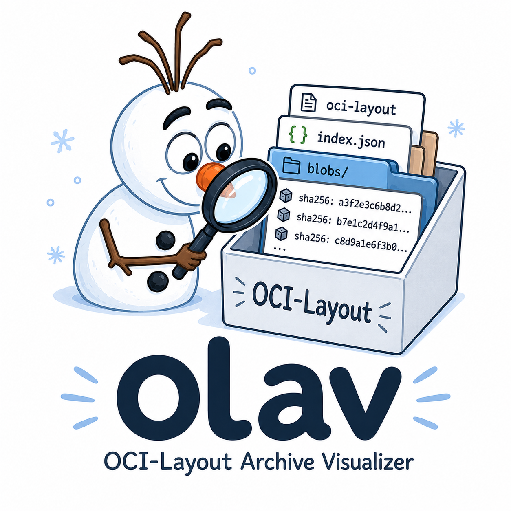
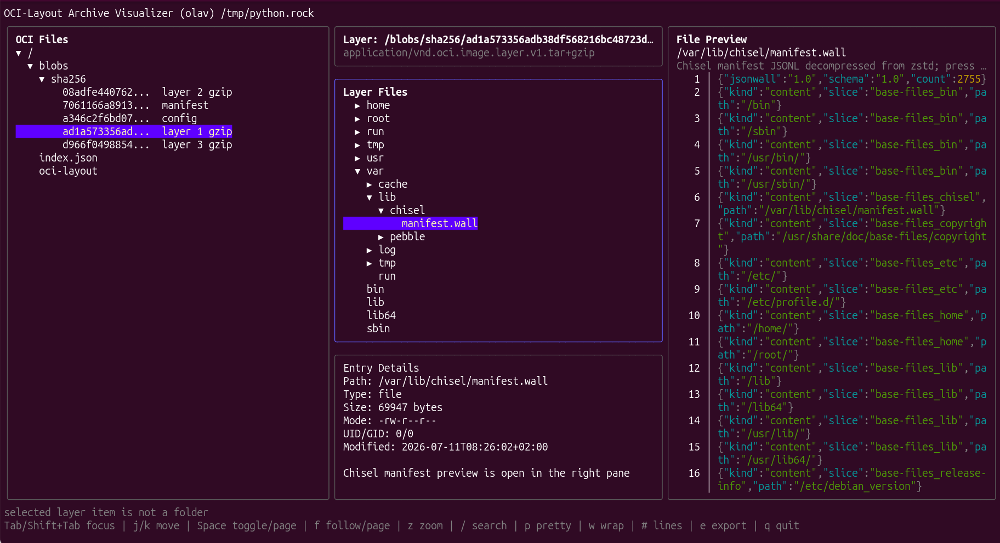

<p align="center">
   
</p>


# OCI-Layout Archive Visualizer

`olav` is a terminal UI for inspecting OCI image layouts, OCI layout archives, remote registry images, and images from a local Docker daemon.

It keeps the raw OCI layout visible, adds a semantic image graph for multi-platform images, previews text and JSON blobs, inspects layer tarballs, and exports selected files.



## Installation

From the Snap Store:

```sh
sudo snap install olav
```

Or install the latest Go release:

```sh
go install github.com/canonical/olav/cmd/olav@latest
```

For local development:

```sh
go run ./cmd/olav <source>
```

## Usage

Local OCI inputs:

```sh
olav ./oci-layout
olav ./oci-layout.tar
olav oci:./oci-layout
olav oci-archive:./oci-layout.tar
```

Remote registry and Docker daemon inputs require explicit transport prefixes:

```sh
olav docker://ubuntu:24.04
olav docker://ubuntu@sha256:<digest>
olav --platform linux/amd64 docker://ubuntu:24.04
olav --platform all docker://ubuntu:24.04
olav docker-daemon:ubuntu:24.04
olav docker-daemon:repo/image@sha256:<digest>
```

Use `--resolve-only` to resolve, cache, and validate an input without starting the TUI:

```sh
olav --resolve-only docker://ubuntu:24.04
```

For `docker://` sources, `olav` pulls the current machine platform by default. Use `--platform os/arch` or `--platform os/arch/variant` to select a platform. Use `--platform all` to pull and inspect the full multi-platform image index. `--platform` is rejected for `docker-daemon:` sources.

Docker `docker save` archives are intentionally not supported. Convert them to OCI layout first, for example with `skopeo`.

## Cache And Auth

Remote and daemon images are copied into the cache as OCI layouts before opening. The cache uses `$XDG_CACHE_HOME/olav` or `~/.cache/olav`.

During image copy, `olav` prints progress information to stderr before entering the TUI.

Authentication uses Docker and containers auth-file locations:

- `~/.docker/config.json`
- `$DOCKER_CONFIG/config.json`
- `$REGISTRY_AUTH_FILE`
- `${XDG_RUNTIME_DIR}/containers/auth.json`
- `~/.config/containers/auth.json`

If authentication fails, `olav` prints a hint pointing to these paths. Login with `docker`, `podman`, or `skopeo` before retrying private images.

### Snap Cache And Auth

The snap keeps its cache under `~/snap/olav/common/.cache/olav` so downloaded images remain available after snap upgrades.

Strict confinement cannot read the host's hidden Docker and containers auth files. Create credentials in the snap's persistent data directory instead:

```sh
mkdir -p "$HOME/snap/olav/common/.docker"
DOCKER_CONFIG="$HOME/snap/olav/common/.docker" docker login
```

For a containers auth file, place it at `~/snap/olav/common/containers/auth.json`. Docker configurations that invoke host credential helpers are not supported inside the strict snap; use a dedicated configuration containing registry credentials or tokens.

Registry access and ordinary, non-hidden files under the home directory are available automatically. Access to removable media and the Docker daemon must be connected explicitly when needed:

```sh
sudo snap connect olav:removable-media
sudo snap connect olav:docker
```

The Snap Store requires publisher approval for the privileged `docker` interface before that connection is available to Store installs.

If Docker itself is installed as a snap, connect directly to its daemon slot:

```sh
sudo snap connect olav:docker docker:docker-daemon
```

Strict confinement does not provide access to arbitrary locations such as `/srv`, hidden home directories, nonstandard Unix sockets, or exports outside connected locations.

For `docker-daemon:name@sha256:<digest>`, `olav` resolves the digest through the daemon's local `RepoDigests` and copies the matching local image. The digest-pinned image must already exist locally. Docker daemon export can reconstruct manifests, so remote registry manifest bytes are not always preserved byte-for-byte through daemon sources. Use `docker://name@sha256:<digest>` when the exact registry manifest digest must be inspected.

## Views

Press `v` while the left pane is focused to switch between:

- OCI Layout: the raw archive/directory file layout
- Image Graph: semantic index, platform, manifest, config, layer, and artifact relationships

The Image Graph view is useful for multi-architecture images because it groups blobs under the manifests and platforms that reference them without changing the raw OCI layout view. It also labels common attestation manifests and includes platform/annotation summaries where available.

Graph nodes are expanded by default. Press `Ctrl+Space` in Image Graph view to expand or collapse all graph nodes.

The raw OCI Layout view remains a faithful file tree, but blob names include graph-derived role and platform hints when available.

## Keys

- `Tab` / `Shift+Tab`: switch focus forward/backward between visible panes
- `v`: switch the left pane between raw OCI layout and image graph views
- `j` / `k`: move down/up in trees or scroll focused preview
- `Space`: expand/collapse folders in tree panes, or page down in preview panes
- `Ctrl+Space`: expand/collapse all graph nodes in Image Graph view
- `Enter` / `l` / `Right`: expand or open in tree panes
- `h` / `Left`: collapse in tree panes
- `/`: search focused pane
- `n` / `N`: next/previous preview search match
- `p`: toggle raw/pretty JSON for the focused preview
- `w`: toggle wrapping for the focused preview
- `#`: toggle line numbers for the focused preview
- `z`: toggle zoom for the focused preview
- `e`: export selected file to `./olav-export/`
- `g` / `G`: jump to top/bottom
- `f`: follow selected symlink in layer file tree, or page down in previews
- `b`: page up in previews
- `Ctrl-D` / `Ctrl-U`: half-page down/up in previews
- `h` / `l` or `Left` / `Right`: horizontal scroll when preview wrapping is disabled
- `0` / `$`: jump to first/last preview column when preview wrapping is disabled
- `?`: show help
- `q`: quit, or exit preview zoom mode when zoomed

The bottom line always shows the main key help. Transient messages, search prompts, and export/open results are shown on the line above it.

## Preview Behavior

- JSON can be toggled between raw and pretty views with `p`.
- Pretty JSON is syntax-colored.
- Top-level JSON starts in pretty mode when it is small enough to format cheaply.
- Text files inside layer tarballs start in raw mode.
- Text previews wrap by default and can be toggled with `w`.
- Text previews show line numbers by default and can be toggled with `#`.
- When wrapping is disabled, use horizontal scrolling to inspect long lines.
- Press `z` while focused on a preview pane to zoom it; press `z` or `q` again to restore the split-pane layout.
- Python, shell, and YAML files are syntax-highlighted in text previews.
- Zstd-compressed files named `manifest.wall` inside layer tarballs are decompressed in memory and rendered as syntax-colored Chisel manifest JSONL.
- For Chisel manifest JSONL, `p` toggles readable separator spacing while keeping each JSONL item on one line.
- Symlinks to text files inside layer tarballs are previewed as their targets.
- Press `f` on a symlink in the layer file tree to jump to its target when it exists.

## Layer Tarballs

Layer blobs are detected from OCI media types and can be plain tar, gzip-compressed tar, or zstd-compressed tar.

When a layer is opened for the first time, `olav` indexes it in the background and shows a centered overlay:

```text
Extracting tarball.
This can take a while for large tarballs.
```

The selected OCI blob remains highlighted while extraction is running. Once indexed, the layer view shows:

- Layer metadata at the top of the right pane
- Layer file tree in the middle
- Entry details at the bottom
- A third preview pane when the selected layer entry is a text file

Non-text files inside layer tarballs show metadata only.

## Performance Controls

By default, `olav` automatically opens layer tarballs when they are selected only if the OCI layout has at most three layer tarballs. This avoids expensive accidental extraction when inspecting large multi-platform images. Set `MAX_NUM_AUTO_TARBALL_EXTRACTION` to change the threshold:

```sh
MAX_NUM_AUTO_TARBALL_EXTRACTION=0 olav docker://ubuntu:24.04
MAX_NUM_AUTO_TARBALL_EXTRACTION=10 olav --platform all docker://ubuntu:24.04
```

When auto extraction is disabled by the threshold, select a layer and press `Enter`, `l`, or `Right` to open it explicitly.

Large top-level blobs are also not previewed automatically. Set `MAX_AUTO_TEXT_PREVIEW_BYTES` to change the default 1 MiB threshold. Select a large blob and press `Enter`, `l`, or `Right` to preview it explicitly.

```sh
MAX_AUTO_TEXT_PREVIEW_BYTES=0 olav ./oci-layout
MAX_AUTO_TEXT_PREVIEW_BYTES=10485760 olav ./oci-layout
```

## Export Layout

Top-level OCI files are exported under:

```text
olav-export/oci-layout/<original OCI path>
```

Files selected inside layer tarballs are exported under:

```text
olav-export/layers/<layer blob path>/<original layer path>
```

Layer file hierarchy is preserved.

## Supported Inputs

- OCI image layout directories
- OCI image layout tar archives
- Remote registry images through `docker://`
- Local Docker daemon images through `docker-daemon:`
- Layer blobs compressed as plain tar, gzip, or zstd

## Maintenance

The repository includes GitHub Actions workflows for unit tests, source integration checks, and daily CodeQL scanning. Renovate is configured to open updates for Go modules and GitHub Actions.

## Snap Packaging

Build the snap locally with:

```sh
sudo snap install snapcraft --classic
snapcraft pack
sudo snap install --dangerous ./olav_*.snap
```

The recipe pins both `version` and `source-tag` to a GitHub release. Update both values to the same `X.Y.Z` / `vX.Y.Z` release before building a new snap. Build `amd64` and `arm64` revisions natively or with the Snapcraft remote build service:

```sh
snapcraft remote-build
```

After reserving the `olav` name and authenticating with the Snap Store, upload tested revisions to `edge` before promoting them to `candidate` and `stable`:

```sh
snapcraft upload --release=edge olav_*.snap
```
